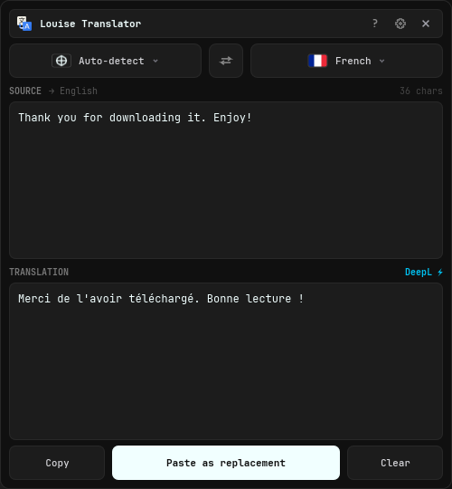
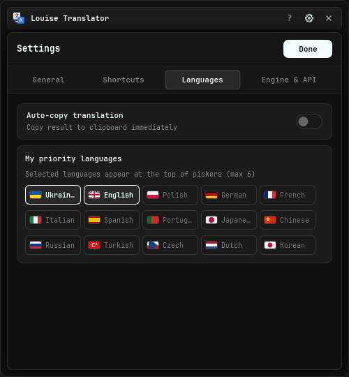
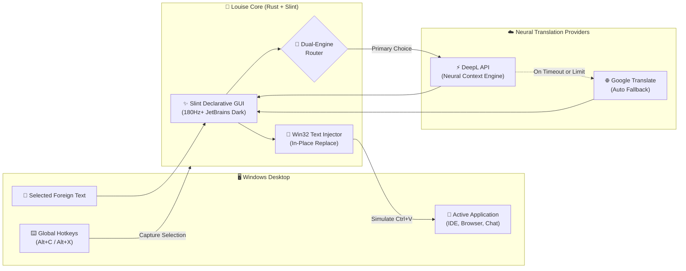

<div align="center">

<p align="center">
  
</p>

# 🌌 Louise (Dr. Louise Banks)
### Discreet, Keyboard-First Instant Desktop Translator for Windows

<p align="center">
  <a href="https://github.com/MarianQQQ/LouiseTranslator">
    
  </a>
</p>

[](https://www.rust-lang.org/)
[](https://slint.dev/)
[](https://microsoft.com)
[](https://www.deepl.com/)
[](LICENSE)
[](#-the-philosophy-behind-louise)

<br>

<p align="center">
  
</p>

<br>

> *«Language is the first weapon drawn in a conflict... or the first hand extended in understanding.»*  
> — **Dr. Louise Banks**, *Arrival* (2016)

<br>

[**The Philosophy**](#-the-philosophy-behind-louise) • [**Interface Showcase**](#-interface-showcase) • [**Key Features**](#-key-features) • [**Dual-Engine Architecture**](#-dual-engine-architecture) • [**Shortcuts**](#-shortcuts-cheatsheet) • [**System Architecture**](#-system-architecture) • [**Quick Start**](#-quick-start--build)

</div>

<br>

---

## 🎬 The Philosophy Behind Louise

<div align="center">
  <table border="0" style="border: none; background: transparent;">
    <tr>
      <td width="48%" align="center" style="vertical-align: middle; border: none; padding: 10px;">
        
      </td>
      <td width="52%" style="vertical-align: middle; border: none; padding-left: 20px; text-align: left;">
        <h3>👩‍🔬 Dr. Louise Banks — The Heart of Communication</h3>
        <p>
          <i>«If you could see your whole life from start to finish, would you change things?»</i>
        </p>
        <p>
          In Denis Villeneuve's masterpiece <b>«Arrival»</b> (adapted from Ted Chiang's <i>«Story of Your Life»</i>), linguistics professor <b>Dr. Louise Banks</b> (played by Amy Adams) is summoned when enigmatic alien vessels hover silently over the planet. Where military factions prepare for confrontation, Louise enters the unknown with stillness, patience, and profound empathy.
        </p>
        <p>
          By deciphering their circular ink logograms (<i>Heptapod B</i>), she discovers that learning a new language isn't just about translating words — it fundamentally alters how we experience time, thought, and our connection to one another.
        </p>
        <p>
          <b>Louise Translator</b> is built upon this exact ethos: an elegant, quiet, distraction-free desktop companion that dissolves communication barriers instantly without ever getting in your way.
        </p>
      </td>
    </tr>
  </table>
</div>

<p align="center">
  
</p>

---

## 📸 Interface Showcase

<p align="center">
  
  &nbsp;&nbsp;
  
</p>
<p align="center">
  <i>Left: Minimalist Dark UI with Auto-detect, DeepL ⚡ badge, and inline actions. Right: Fast Priority Languages customization with SVG flags.</i>
</p>

---

## ✨ Key Features

- **⚡ Instant Selection Capture (`Alt + C`)**:
  Highlight foreign text in any Windows app (browser, Discord, IDE, PDF reader, Slack) and hit `Alt + C`. Louise appears next to your mouse with zero delay.
- **🪟 Instant Window Toggle (`Alt + X`)**:
  Hit `Alt + X` to summon Louise near your cursor for manual input, or hit `Alt + X` again while open to instantly hide it back to tray.
- **🔄 In-Place Paste Replacement**:
  Replace foreign text with the translated text in one keystroke (`Paste as replacement`). Louise automatically focuses your previous window and simulates seamless replacement.
- **🧠 Dual-Engine Architecture (DeepL Neural AI + Google Translate)**:
  Choose between **DeepL Pro/Free API** (ultra-natural European phrasing, idiomatic accuracy) and **Google Translate** (instant, free, unlimited).
- **📊 Real-Time Dynamic Quota Tracking**:
  Directly polls the DeepL usage API to accurately calculate remaining characters for both Free tier (500k) and paid Pro / custom subscription limits.
- **🛡️ Fail-Safe Auto Fallback**:
  If DeepL encounters network drops, quota exhaustion, or unsupported dialects, Louise automatically falls back to Google Translate and notifies you via a sleek toast banner.
- **🌐 Default Auto-Detection**:
  The source language always defaults to smart **Auto-Detect** (`auto`), adapting instantly without resetting your selected target language.
- **🔒 100% Offline Privacy & Hardware-Encrypted DPAPI Keys**:
  Zero telemetry, zero external trackers. The executable ships with **zero hardcoded keys**. All user settings are stored locally in portable `config.json`, with API keys hardware-encrypted via Windows Data Protection API (DPAPI).
- **🖤 Bespoke Monochrome Dark Palette**:
  Deep `#101010` background, subtle borders, high-contrast typography, JetBrains Mono font, and buttery 180+ Hz zero-dead-zone window dragging.
- **⌨️ Fully Customizable Hotkeys with Layout Agility**:
  Separate customization for selection translation and window toggle with release-to-commit key recording. Seamlessly supports both English and Ukrainian/Cyrillic keyboard layouts across all shortcuts including in-app <kbd>Ctrl</kbd>+<kbd>C</kbd>, <kbd>Ctrl</kbd>+<kbd>V</kbd>, <kbd>Ctrl</kbd>+<kbd>A</kbd>, and <kbd>Ctrl</kbd>+<kbd>X</kbd>.
- **🚀 Native Rust & Slint Performance**:
  No Chromium, no Electron, no JavaScript runtime. Tiny memory footprint (~60 MB RAM) and sub-15ms cold start.

<p align="center">
  
</p>

---

## 🧠 Dual-Engine Architecture

<div align="center">

| Capability | ⚡ DeepL API (Neural AI) | 🌐 Google Translate (Built-in) |
| :--- | :--- | :--- |
| **Translation Engine** | Advanced Neural Machine Translation | Google Cloud Neural Translate |
| **Phrasing Quality** | Human-like nuance, idioms & natural flow | Fast, literal & reliable |
| **Setup Required** | Free or Pro API key (Auto-detects plan limit) | **None** (zero setup) |
| **Languages** | 30+ major languages (European, Asian) | 100+ global languages |
| **Redundancy** | Automatically falls back to Google on failure | Built-in fallback engine |
| **Status Badge** | `DeepL ⚡` (Cyan) | `Google` (Muted) / `Google 🔄` (Amber Fallback) |

</div>

<details>
<summary><b>🔑 How to get and set up your Free DeepL API Key (Click to expand)</b></summary>
<br>

1. Register for a free DeepL API account at [deepl.com/pro-api](https://www.deepl.com/pro-api) (Free plan provides 500,000 characters every month; Pro plans offer larger/unlimited tiers).
2. Copy your **Authentication Key** (Free keys end with `:fx`, e.g., `xxxxxxxx-xxxx-xxxx-xxxx-xxxxxxxxxxxx:fx`).
3. Open Louise Settings (`⚙`) → **Engine & API** tab.
4. Click the **DeepL API** card and paste your key into the text field.
5. The badge will instantly turn green (`Active ✓`) and your remaining quota will appear in real time!

</details>

---

## ⌨️ Shortcuts Cheatsheet

<div align="center">

| Key Combination | Action | Scope | Description |
| :---: | :--- | :---: | :--- |
| <kbd>Alt</kbd> + <kbd>C</kbd> | **Translate Selection** | Global | Primary hotkey; captures highlighted text and opens Louise near mouse |
| <kbd>Alt</kbd> + <kbd>X</kbd> | **Toggle Window** | Global | Opens or closes Louise near cursor preserving current text (instant toggle) |
| <kbd>Ctrl</kbd> + <kbd>Enter</kbd> | **Translate Input** | In-App | Instantly triggers translation for manually typed source text |
| <kbd>Ctrl</kbd> + <kbd>C</kbd> / <kbd>V</kbd> / <kbd>A</kbd> / <kbd>X</kbd> | **Clipboard Actions** | In-App | Full bidirectional copy/paste working in both English and Ukrainian layouts |
| <kbd>Escape</kbd> | **Dismiss to Tray** | In-App | Silently hides Louise window back to the system tray |
| <kbd>Right Click</kbd> | **Context Menu** | In-App | Opens contextual menu for Copy, Paste, and Clear |

</div>

<details>
<summary><b>🛠️ How to record a Custom Key Combination (Click to expand)</b></summary>
<br>

1. Open Louise Settings (`⚙`) → **Shortcuts** tab.
2. Choose either **Translate Selection** or **Open Window**.
3. Click the recording field and hold down your desired combination (e.g. `Ctrl + Shift + T` or `Alt + Z`). The UI dynamically displays held keys in real-time.
4. Releasing the keys immediately commits the new combination and suspends old defaults.

</details>

---

## 🛠️ System Architecture



- **GUI Toolkit**: [Slint](https://slint.dev/) (native compiled lightweight GUI)
- **Language**: [Rust](https://www.rust-lang.org/) (2024 Edition, zero runtime overhead)
- **OS Subsystem**: `windows-rs` (Win32 API, DWM frame controls, SendInput injection, DPAPI)
- **Global Hotkeys**: `global-hotkey`
- **System Tray**: `tray-icon`
- **Clipboard Management**: `arboard`

<p align="center">
  
</p>

---

## 🚀 Quick Start & Build

### Option 1: Run Release Executable
1. Download `Louise Translator.exe` from [Latest Releases](https://github.com/MarianQQQ/LouiseTranslator/releases).
2. Run `Louise Translator.exe` (it will start discreetly in your system tray).
3. Highlight any text and press `Alt + C`.

### Option 2: Build from Source

#### Prerequisites
* [Rust Toolchain](https://rustup.rs/) (1.85+ recommended)
* Windows 10 or Windows 11
* Visual Studio C++ Build Tools

#### Compilation
```powershell
# 1. Clone the repository
git clone https://github.com/MarianQQQ/LouiseTranslator.git
cd LouiseTranslator

# 2. Compile optimized release build
cargo build --release

# 3. Executable will be located at:
# target\release\LouiseTranslator.exe
```

---

## 📂 Configuration

Preferences are stored locally in `config.json` alongside the executable:

```json
{
  "popup_mode": true,
  "always_on_top": true,
  "auto_copy": false,
  "close_on_paste": false,
  "src_lang": "auto",
  "dst_lang": "uk",
  "priority_langs": ["uk", "en", "pl"],
  "ui_lang": "en",
  "enable_alt_c": true,
  "use_deepl": true,
  "deepl_key": "YOUR_KEY_HERE:fx",
  "autostart": true
}
```

> [!NOTE]
> `config.json` is protected by `.gitignore` — your personal keys and preferences will never be tracked or committed.

---

<div align="center">

If Louise makes your multilingual workflow calmer and faster, consider giving the repository a star ⭐!

[](https://github.com/MarianQQQ/LouiseTranslator/stargazers)
[](https://github.com/MarianQQQ/LouiseTranslator/network/members)
[](https://github.com/MarianQQQ/LouiseTranslator/issues)

</div>

---

## 📜 Credits & Acknowledgments

- **Denis Villeneuve & Ted Chiang**: For the timeless world, linguistic depth, and soul of *Arrival*.
- **The Slint Team**: For creating the most responsive, elegant modern GUI toolkit.
- **DeepL & Google**: For providing world-class translation APIs.

---

## 📄 License

Distributed under the [MIT License](LICENSE) © 2026.
